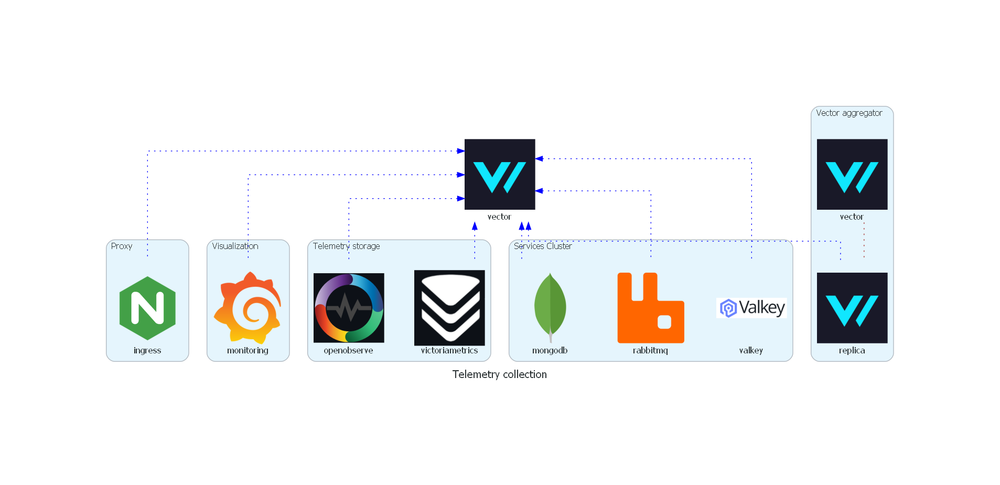
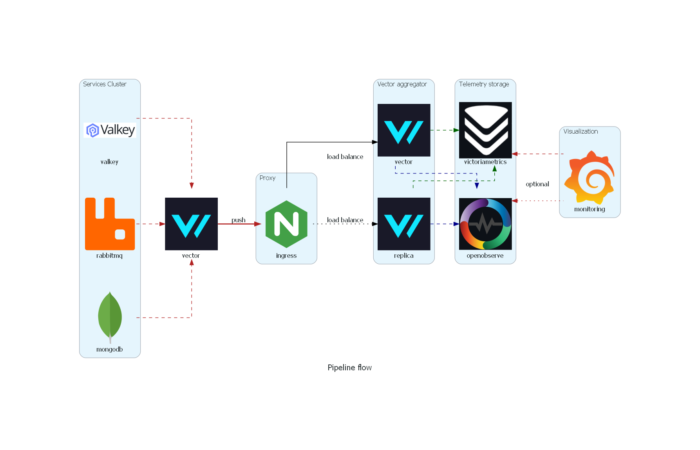
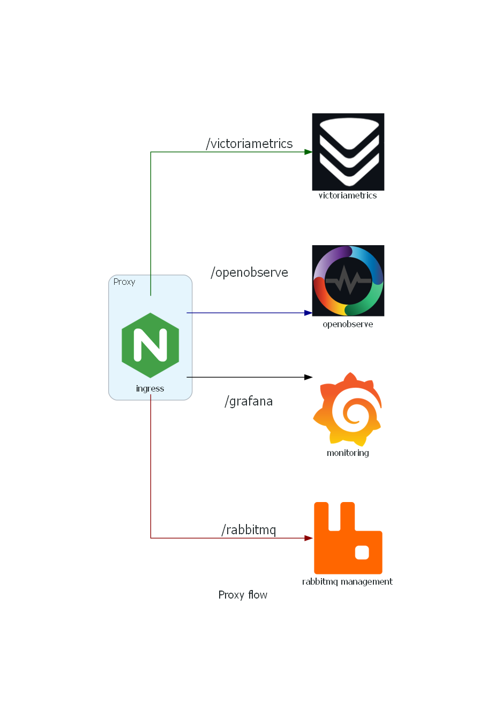

# telemetry pipeline

This projects demonstrates how to use [Vector](https://vector.dev/) to collect telemetry data from different "infrastructure" services and send it to different sinks.



The pipeline uses the [Aggregattor](https://vector.dev/docs/setup/going-to-prod/arch/aggregator/) architecture which provides higher availability and scalability.

Telemetry collected by Vector "agent" is sent to Nginx, which is used as a load balancer to distribute the load to multiple Vector services that aggregate the data and push it to multiple sinks.



Access to the different UIs is done through Nginx, which proxies the requests to the different services.



## Requirements

- Docker
- Docker Compose
- [cfssl](https://github.com/cloudflare/cfssl) *optional*: used to generate self-signed certificates

## Getting Started

### Run the pipeline

```shell
docker compose up -d
```

### Access OpenObserve

go to [https://localhost:8082/openobserve](https://localhost:8082/openobserve) and login with the credentials, i.e. the values of the environment variables `ZO_ROOT_USER_EMAIL` and `ZO_ROOT_USER_PASSWORD`

### Access Grafana

go to [https://localhost:8082/grafana](https://localhost:8082/grafana) and login with the credentials, i.e. the values of the environment variables `GF_SECURITY_ADMIN_USER` and `GF_SECURITY_ADMIN_PASSWORD`

### Access VictoriaMetrics

go to [https://localhost:8082/victoriametrics](https://localhost:8082/victoriametrics)

### Access RabbitMQ

go to [https://localhost:8082/rabbitmq](https://localhost:8082/rabbitmq) and login with the credentials, i.e. the values of the environment variables `RABBITMQ_DEFAULT_USER` and `RABBITMQ_DEFAULT_PASS`


## Troubleshooting

### examine vector events as they come

[docs](https://vector.dev/guides/level-up/vector-tap-guide/)

vector [api](https://vector.dev/docs/reference/api/) must be enabled

```yaml
api:
  enabled: true
  address: 0.0.0.0:8686
```

```shell
docker exec -it vector vector tap --inputs-of openobserve_prometheus | tee vector-metrics-input-to-sink.json
```

## generate self-signed certificate
```shell
cfssl genkey -initca csr.json | cfssljson -bare ca
cfssl gencert -ca ca.pem -ca-key ca-key.pem csr.json | cfssljson -bare cert

```

## Bonus

### Collect and send telemetry using Opentelemetry collector

Although not mentioned in the diagrams, the pipeline uses [Opentelemetry collector](https://opentelemetry.io/docs/collector/) to collect telemetry data from the different services and send it directly to the sinks, in this case only Openobserve but in can be easily configured to push data to other sinks. **Caveats** Some receivers do not work properly on WSL2, also metrics names are not "compatible" with many of the published Grafana dashboards.
